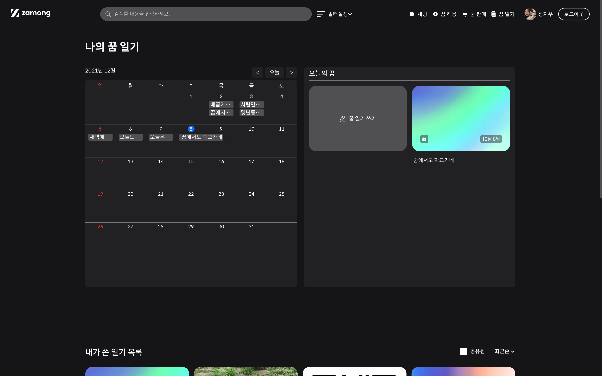
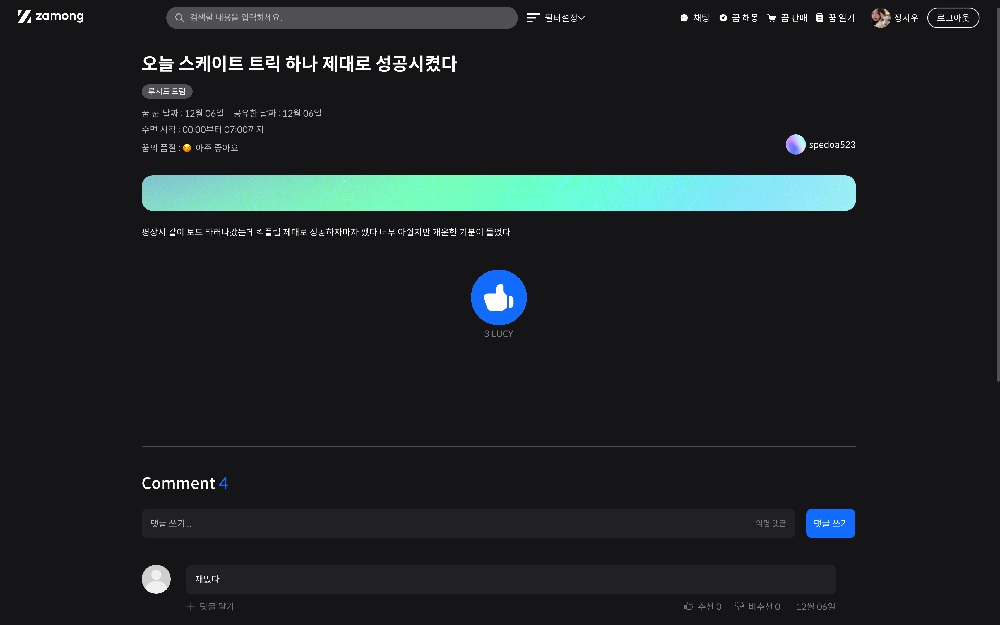
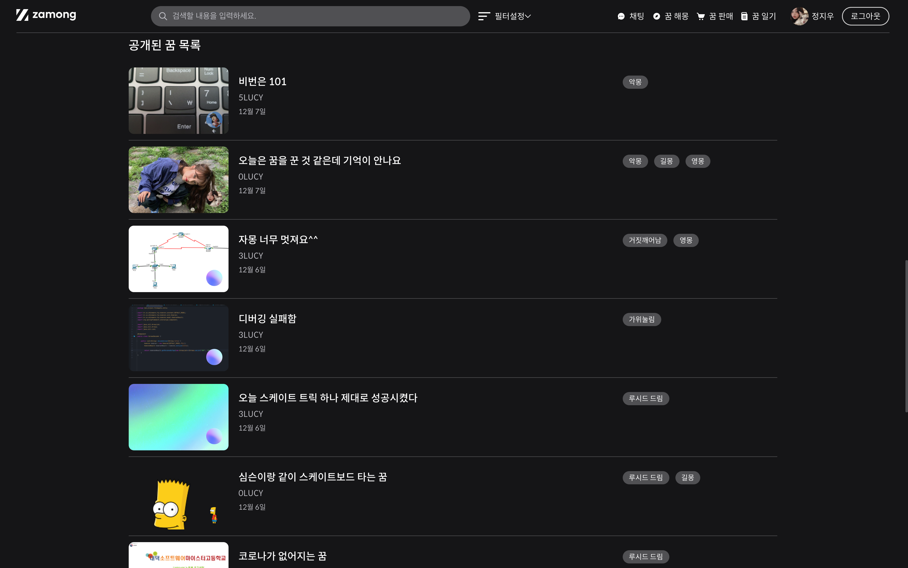

# ZAMONG-Backend-V1

  

## Documentation

프로젝트 설계에 관한 세부사항을 [OGJG-ZAMONG/ZAMONG-Backend-V1/wiki](https://github.com/OGJG-ZAMONG/ZAMONG-Backend-V1/wiki)에서 확인할 수 있습니다.

## Description

### Key Features
* 꿈 기록 및 공유
* 꿈 해몽
* 꿈 판매

## Reference

* [Spring boot Graceful Shutdown - 용감한 남매들 Tech Blog](https://bravenamme.github.io/2020/10/06/graceful-shutdown/)
* [Gradle 프로젝트에 JaCoCo 설정하기 - 우아한형제들 기술 블로그](https://techblog.woowahan.com/2661/)
* [Spring Security Reference - Spring Docs](https://docs.spring.io/spring-security/site/docs/5.3.2.RELEASE/reference/html5/#preface)
* [Guide to Spring Email - Baeldung](https://www.baeldung.com/spring-email)
* [Lombok Builder Inheritance - Baeldung](https://www.baeldung.com/lombok-builder-inheritance)
* [AWS S3 with Java](https://www.baeldung.com/aws-s3-java)
